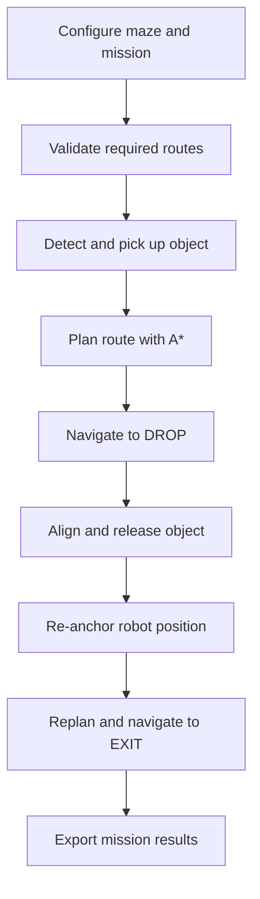
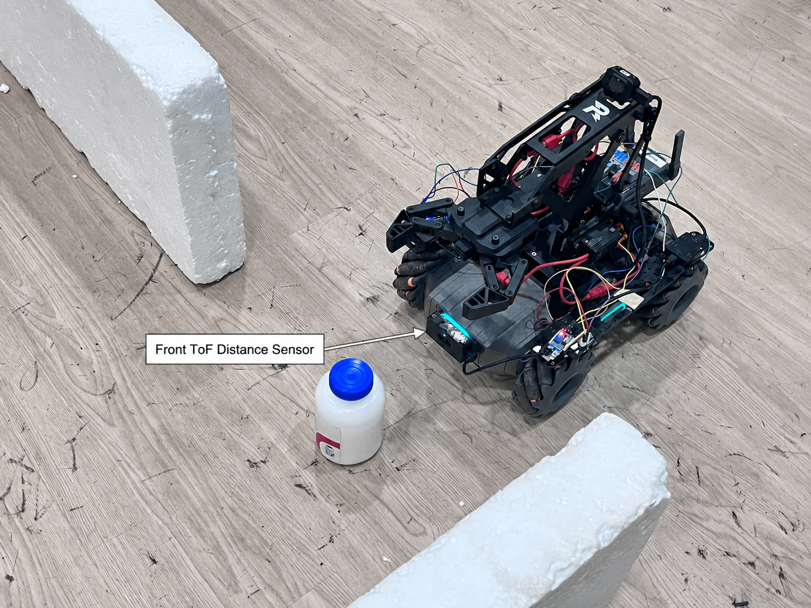

# RoboMaster Autonomous Maze Navigation

An autonomous fixed-grid maze navigation and object-delivery system for the DJI RoboMaster EP. The robot uses orientation-aware A* path planning, wheel odometry, yaw feedback, a front ToF sensor, and left/right Sharp IR sensors to pick up an object, navigate to a drop-off location, release the object, and exit the maze safely.

> The primary navigation mode is designed for a fixed grid with known cell dimensions. The robot does not use a camera, SLAM, ROS 2, or external absolute localization.

## Demo

The following video demonstrates a complete real-world mission, including object pickup, autonomous maze navigation, drop-position alignment, object release, and navigation to the exit.

[](https://youtu.be/N6wTUV7ljIg)

**Video:** [RoboMaster EP Autonomous Maze Navigation | A* Pickup & Drop Mission](https://youtu.be/N6wTUV7ljIg)

## Project Overview

The maze and mission are configured through a Tkinter GUI before the robot starts moving. The operator can define the grid dimensions, physical cell size, known walls, and the `START`, `DROP`, and `EXIT` cells. The system validates the required routes, controls the physical robot, updates wall evidence from live sensor readings, and exports the final map, robot trajectory, sensor history, and mission report after each run.

The system combines high-level route planning with low-level sensor-based motion control:

- A* determines which grid cells the robot should visit.
- Wheel odometry estimates the distance travelled inside each cell.
- Yaw feedback maintains the required heading and supports closed-loop turns.
- The front ToF sensor detects obstacles and controls front-wall alignment.
- The left and right Sharp IR sensors maintain side-wall distance.
- The robotic arm and gripper perform the pickup and drop actions.
- Persistent wall evidence reduces false walls caused by isolated or angled sensor readings.

If a planned route becomes unavailable, the system can replan using updated wall information or use a Trémaux-style exploration fallback.

## Mission Workflow



1. Configure the maze, mission markers, sensor settings, and motion parameters in the GUI.
2. Validate that routes exist from `START` to `DROP` and from `DROP` to `EXIT`.
3. Detect, approach, grasp, and verify the object using the front ToF sensor.
4. Generate an orientation-aware A* route to the drop-off cell.
5. Follow the route using odometry, yaw feedback, obstacle detection, and side-wall correction.
6. Align the object with the configured front and side wall distances.
7. Release the object and return the arm to its carrying position.
8. Compensate for movement performed during drop alignment and re-anchor the robot.
9. Plan and follow a route from the drop-off cell to the exit.
10. Drive outside the maze and export the mission artifacts.

## GUI-Based Mission Configuration

The GUI provides a visual editor and mission monitor. It allows the operator to configure:

- Grid rows and columns
- Physical cell dimensions
- `START`, `DROP`, and `EXIT` cells
- Known maze walls
- Initial robot heading
- Motion speed and safety thresholds
- Pickup and drop parameters
- Object-to-wall target distances
- ToF and Sharp IR sensor mounting offsets
- Optional Sharp IR calibration files
- Simulation or real-robot operation


## Robot Hardware and Sensor Layout

### Top View

The top view shows the front-left and front-right digital IR sensors together with the two side-facing Sharp IR distance sensors.


### Front ToF View

The front-facing ToF sensor is used for object detection, pickup verification, obstacle stopping, and front-wall alignment during the drop sequence.



## Key Features

- GUI-based fixed-grid maze configuration
- Configurable `START`, `DROP`, and `EXIT` positions
- Route validation before starting the mission
- Orientation-aware A* path planning with turn cost
- Automatic replanning when new obstacles are detected
- Trémaux-style exploration fallback
- Wheel-odometry-based cell movement
- Yaw-feedback heading control and closed-loop turning
- Front ToF obstacle detection and emergency stopping
- Left and right Sharp IR wall-distance control
- Robotic arm and gripper pickup-and-drop control
- ToF-based object detection and pickup verification
- Sensor-offset compensation for accurate object placement
- Persistent wall evidence to reduce false or disappearing walls
- Traversed-edge protection to preserve confirmed open routes
- Post-drop re-anchoring to prevent incorrect map updates
- JSON, final-map SVG, and sensor-graph SVG output
- Simulation mode and hardware-independent unit tests

## Hardware

- DJI RoboMaster EP
- RoboMaster robotic arm and gripper
- Front Time-of-Flight distance sensor
- Left and right Sharp IR distance sensors
- Front-left and front-right digital IR sensors
- RoboMaster wheel odometry
- RoboMaster attitude and yaw feedback

### Sensor Adapter Configuration

The current sensor-adapter configuration is defined in `robomaster_mission/mission.py`.

| Sensor | Adapter ID | Port | Purpose |
|---|---:|---:|---|
| Front-left digital IR | 1 | 1 | Detect nearby obstacles on the front-left side |
| Front-right digital IR | 4 | 1 | Detect nearby obstacles on the front-right side |
| Left Sharp IR | 2 | 1 | Measure left-wall distance |
| Right Sharp IR | 3 | 1 | Measure right-wall distance |

These values must be verified against the wiring of the physical robot before running a real mission.

## Software Architecture

| Module | Responsibility |
|---|---|
| `main.py` | Application entry point and command-line mode selection |
| `configuration.py` | Mission configuration, validation, and drop-target calculations |
| `grid_map.py` | Grid representation and persistent wall evidence |
| `planning.py` | Orientation-aware A* and topological route planning |
| `mission.py` | Sensors, motion control, pickup, navigation, drop, and exit |
| `reporting.py` | JSON, final-map SVG, and sensor-graph SVG generation |
| `gui.py` | Tkinter maze editor and live mission monitor |
| `version.py` | Program and saved-result format version |

## Project Structure

```text
robomaster-autonomous-maze-navigation/
├── main.py
├── README.md
├── requirements.txt
├── .gitignore
├── robomaster_mission/
│   ├── __init__.py
│   ├── configuration.py
│   ├── grid_map.py
│   ├── planning.py
│   ├── mission.py
│   ├── reporting.py
│   ├── version.py
│   └── gui.py
├── tests/
│   └── test_wall_evidence.py
└── docs/
    ├── SETUP.md
    ├── ARCHITECTURE.md
    ├── ALGORITHMS.md
    ├── EXPERIMENTS.md
    ├── HARDWARE.md
    ├── TROUBLESHOOTING.md
    ├── MEDIA.md
    ├── images/
    │   ├── robot/
    │   ├── field/
    │   └── gui/
    ├── videos/
    └── results/
```

## Requirements

- Windows 10 or Windows 11
- Python 3.10 recommended
- DJI RoboMaster EP for real-robot operation
- A network connection to the robot using AP, STA, or RNDIS mode

The DJI RoboMaster Python SDK may not be available as a normal PyPI package for newer Python versions. The recommended `requirements.txt` entry is:

```text
robomaster @ https://github.com/dji-sdk/RoboMaster-SDK/archive/refs/heads/master.zip
```

## Installation

Clone the repository and enter the project directory:

```powershell
git clone https://github.com/nattannsra18/robomaster-autonomous-maze-navigation.git
cd robomaster-autonomous-maze-navigation
```

### PowerShell

Create and activate a Python 3.10 virtual environment:

```powershell
py -3.10 -m venv .venv
Set-ExecutionPolicy -Scope Process -ExecutionPolicy Bypass
.\.venv\Scripts\Activate.ps1
```

### Command Prompt

If the terminal prompt begins with `C:\`, use the Command Prompt activation script instead:

```cmd
py -3.10 -m venv .venv
.venv\Scripts\activate.bat
```

Install the dependencies:

```powershell
python -m pip install --upgrade pip setuptools wheel
python -m pip install -r requirements.txt
```

Verify the RoboMaster SDK installation:

```powershell
python -c "from robomaster import robot; print('RoboMaster SDK OK')"
```

## Running the Application

Start the graphical application from the project root:

```powershell
python main.py
```

Before starting a real mission:

1. Verify all sensor IDs and ports.
2. Confirm the left and right Sharp IR calibration values.
3. Configure the grid and all three mission markers.
4. Check the pickup, drop, motion, and safety parameters.
5. Validate the route in the GUI.
6. Place the robot at the configured start position and heading.
7. Keep the emergency-stop control accessible.

## Simulation Mode

The planner, GUI, map generation, and report generation can be tested without connecting to a physical robot:

1. Run `python main.py`.
2. Enable `Simulation` in the GUI.
3. Configure the grid, known walls, and mission markers.
4. Validate and start the mission.

Simulation mode validates the logical mission flow and generates result files. It does not reproduce robot physics, wheel slip, turning error, sensor noise, or communication delay.

## Legacy Mode

The original exploration mode can be started without the GUI:

```powershell
python main.py --legacy
```

Legacy mode requires the RoboMaster SDK and a connected physical robot.

## Wall Evidence System

The map stores operator-defined walls separately from walls detected by the robot. A blocked sensor reading adds a wall immediately for safety, while an open reading must be observed three consecutive times before an existing sensor wall is removed.

An edge physically crossed by the robot is stored as strong open-space evidence. This prevents an angled Sharp IR reading near a corner from closing a route that the robot has already traversed. Manual walls and external maze boundaries remain protected from automatic removal.

## Sharp IR Calibration

The built-in calibration table for both Sharp IR sensors is:

| ADC | Distance |
|---:|---:|
| 450 | 10 cm |
| 360 | 20 cm |
| 300 | 30 cm |
| 240 | 40 cm |
| 200 | 50 cm |

Optional left and right calibration JSON files can be selected through the GUI. Calibration distances must be measured directly from the Sharp sensor lens to the wall, not from the center of the robot.

## Generated Results

After a simulation or real mission, the application generates:

- `*_run_YYYYMMDD_HHMMSS.json` — mission configuration, map data, wall evidence, robot path, result status, and sensor history
- `*_map.svg` — configured maze, final wall map, planned path, and actual robot trajectory
- `*_sensor_graph.svg` — front ToF, left Sharp IR, and right Sharp IR distance history

Generated run files are excluded by `.gitignore`. Selected successful runs can be copied into `docs/results/` for documentation and portfolio presentation.

## Sample Real-World Mission Result

The following artifacts were generated from a completed physical-robot mission on August 27, 2026.

### Final Maze and Robot Trajectory


### Sensor Distance History


### Raw Mission Data

[Download the JSON mission report](docs/results/run-20260827-111035/robomaster_basic_maze_run_20260827_111035.json)

## Tests

Run the hardware-independent unit tests from the project root:

```powershell
python -m unittest discover -s tests -v
```

The current tests verify that:

- A single open reading does not remove a confirmed sensor wall.
- Three consecutive open readings remove a sensor wall.
- A blocked reading resets the open-reading streak.
- A physically traversed edge is treated as strong open-space evidence.
- Mission artifacts include a sensor graph.

## Documentation

- [Installation and Setup](docs/SETUP.md)
- [System Architecture](docs/ARCHITECTURE.md)
- [Algorithms](docs/ALGORITHMS.md)
- [Hardware and Sensor Calibration](docs/HARDWARE.md)
- [Experimental Results](docs/EXPERIMENTS.md)
- [Troubleshooting](docs/TROUBLESHOOTING.md)
- [Images, Videos, and Result Files](docs/MEDIA.md)

## Current Limitations

- The primary navigation mode assumes a fixed grid with known cell dimensions.
- Localization accuracy depends on wheel odometry and can be affected by wheel slip.
- Sharp IR measurements depend on calibration, wall angle, mounting position, and surface properties.
- The logical simulation mode does not reproduce physical motion or real sensor behaviour.
- The system does not currently use a camera, SLAM, ROS 2, or absolute localization.
- Real-world performance must be validated on the target robot, maze, and object.

## Safety

This project controls a physical robot. Test at low speed, keep the operating area clear, verify emergency-stop behaviour, and remain ready to stop the robot during every real-world test.

## Project Version

```text
BASIC_FIXED_GRID_ASTAR_PICKUP_DROP_V7_PERSISTENT_WALL_EVIDENCE
```

## Repository

Source code and documentation:

https://github.com/nattannsra18/robomaster-autonomous-maze-navigation
